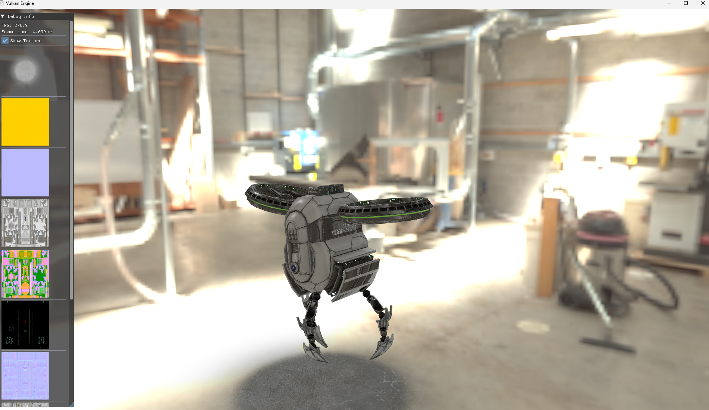

# TakEngine

A Vulkan-based rendering engine featuring PBR with IBL and Linear Blend Skinning support.



## Requirements

### System Requirements

- **C++17** compatible compiler
  - MSVC 2017+ (Windows)
  - GCC 7+ (Linux)
- **CMake** 3.14 or higher
- **Vulkan SDK** — [Download from LunarG](https://vulkan.lunarg.com/)

### Automatically Fetched Dependencies

The following libraries are automatically downloaded and built via CMake's FetchContent:

| Library | Version | Purpose |
|---------|---------|---------|
| GLM | 0.9.9.8 | Mathematics library |
| GLFW | 3.4 | Window/input handling |
| spdlog | 1.12.0 | Logging |
| tinygltf | 2.8.21 | glTF model loading |
| simdjson | 3.10.1 | Fast JSON parsing |
| zstd | 1.5.5 | Compression (for KTX2) |
| Dear ImGui | 1.91.5 | GUI |
| libktx | 4.3.2 | KTX/KTX2 texture loading |

## Building

### Windows

```bash
# Clone the repository
git clone https://github.com/your-username/TakEngine.git
cd TakEngine

# Create build directory
mkdir build
cd build

# Configure and build
cmake ..
cmake --build . --config Release
```

### Linux

```bash
# Install Vulkan SDK and development tools
# Ubuntu/Debian:
sudo apt update
sudo apt install vulkan-sdk cmake build-essential

# Clone and build
git clone https://github.com/your-username/TakEngine.git
cd TakEngine
mkdir build && cd build
cmake ..
cmake --build . -j$(nproc)
```
## Usage

Run the executable with an optional scene selector:

```bash
./TakEngine [scene]
```

### Available Scenes

| Option | Scene | Description |
|--------|-------|-------------|
| 1 | TriangleScene | Basic triangle rendering |
| 2 | ModelTest | Model loading test |
| 3 | PBRIBLScene | PBR with IBL (default) |

### Examples

```bash
# Run default PBR IBL scene
./TakEngine

# Run triangle scene
./TakEngine 1

# Run model test
./TakEngine 2
```
